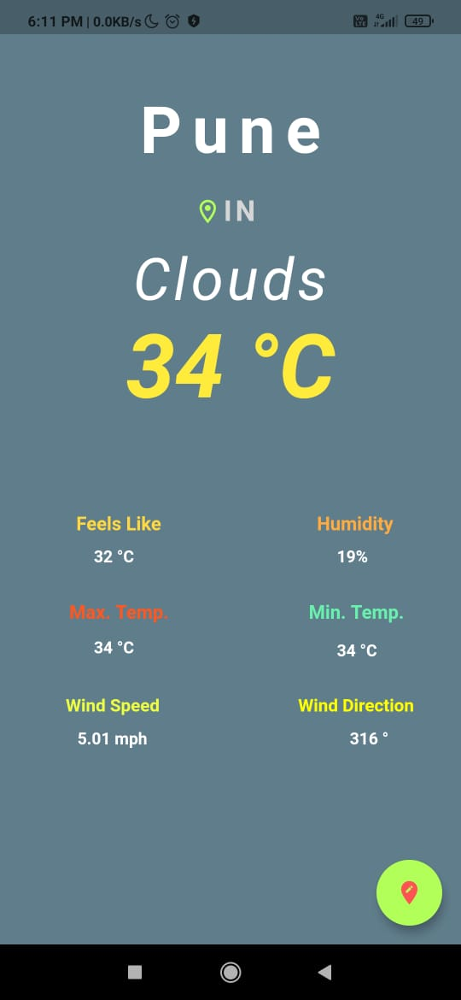
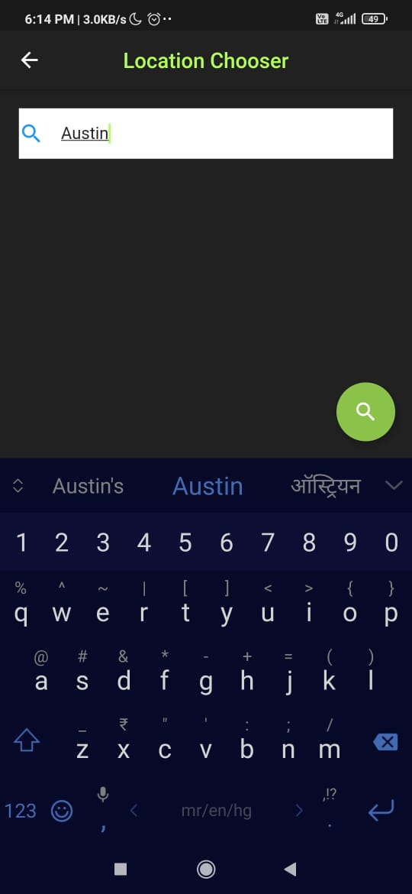
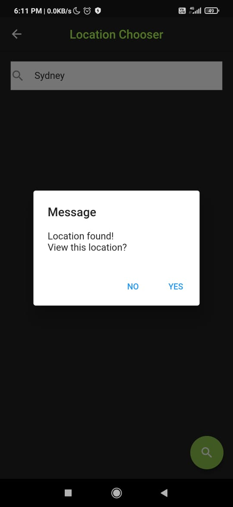
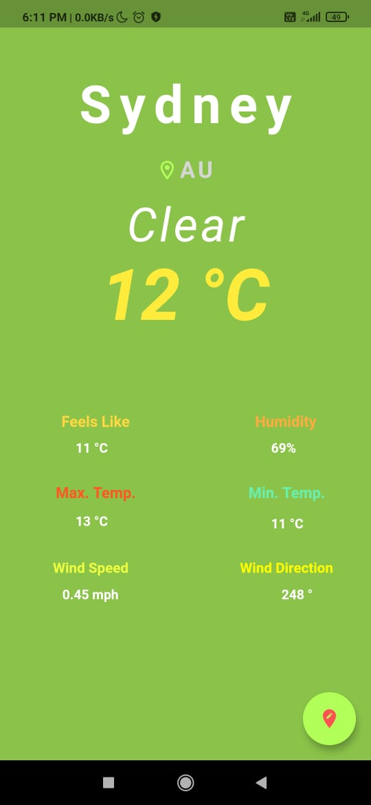

# Weather App- 

- A Flutter application for *fetching & displaying Weather details* about any Location the user wishes to search.
- Background of the main page is *dynamic*, i.e based on the type of weather at the particular location searched.

- API used for procuring weather data: https://openweathermap.org/current

- Screenshots of App:

